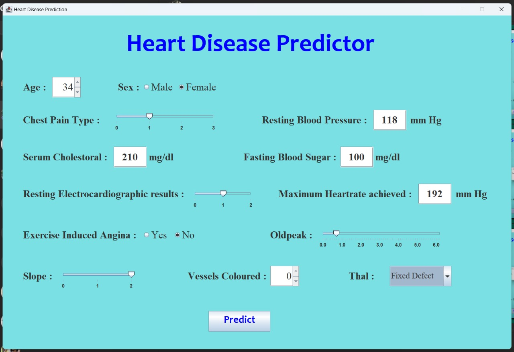
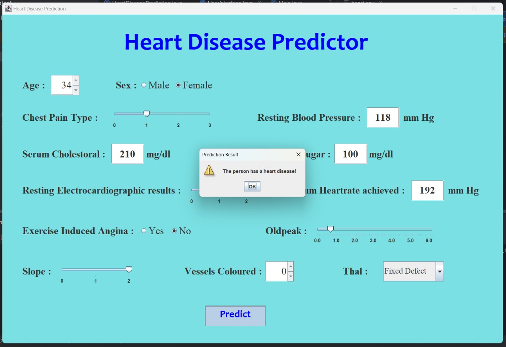
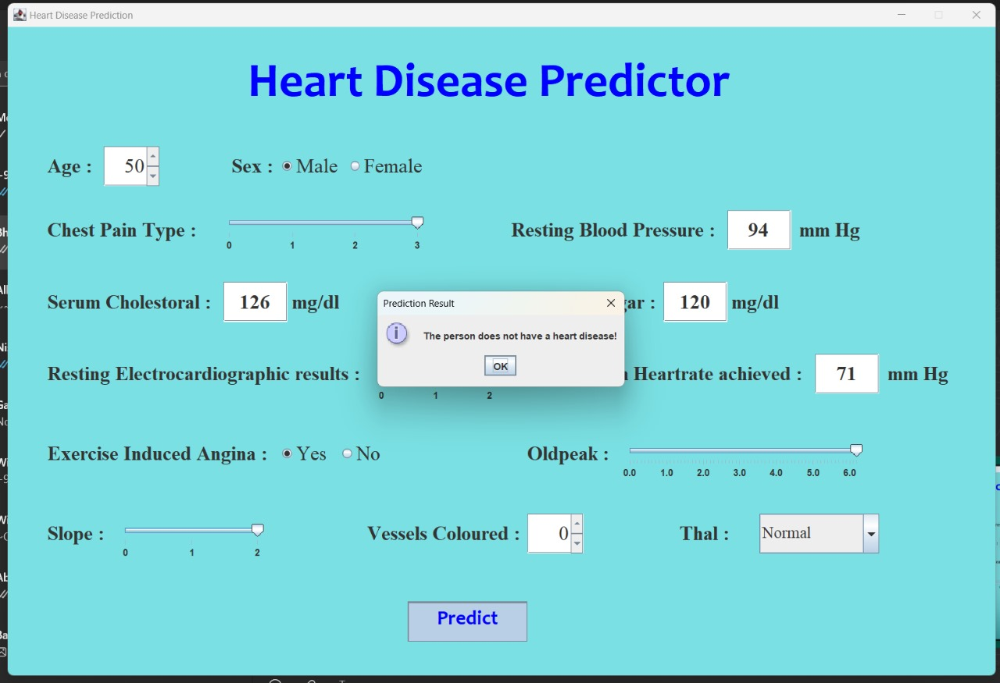

# ❤️ Heart Disease Prediction System  

This project is a **Heart Disease Prediction System** built using **Java**, **Weka Machine Learning Library**, and a **Java Swing UI**.  
The system trains a **Logistic Regression model** on a heart disease dataset (`heart.csv`), saves the model for reuse, and provides a **user-friendly Swing interface** to predict whether a person is at risk of heart disease based on medical attributes.  

---

## 🖼️ Swing UI Preview  

Here is the interface of the prediction system:  

  

Example of prediction result:  

 
 

---

## 📌 Features  

- Load and preprocess dataset (`heart.csv`)  
- Train a **Logistic Regression classifier** using Weka  
- Save and load the trained model (`heart_model.model`)  
- Evaluate the model with accuracy, precision, recall, F1-score, and confusion matrix  
- Use the saved model to make predictions  
- Simple **Java Swing GUI** for input and prediction  

---

## ⚙️ Technologies Used  

- **Java 17+**  
- **Weka (Machine Learning Library)**  
- **Java Swing** (for UI)  
- **CSV dataset (`heart.csv`)**  

---

## 🧠 Dataset  

The dataset used is the **Heart Disease dataset**, commonly available from UCI Machine Learning Repository or Kaggle.  

### Example attributes:  
- `age` – Age of the patient  
- `sex` – Gender (1 = male, 0 = female)  
- `cp` – Chest pain type  
- `trestbps` – Resting blood pressure  
- `chol` – Serum cholesterol (mg/dl)  
- `fbs` – Fasting blood sugar > 120 mg/dl (1 = true, 0 = false)  
- `restecg` – Resting electrocardiographic results  
- `thalach` – Maximum heart rate achieved  
- `exang` – Exercise induced angina (1 = yes, 0 = no)  
- `oldpeak` – ST depression induced by exercise relative to rest  
- `slope` – Slope of the peak exercise ST segment  
- `ca` – Number of major vessels (0–3) colored by fluoroscopy  
- `thal` – Thalassemia (0 = normal, 1 = fixed defect, 2 = reversible defect)  
- `target` – Prediction class (0 = No heart disease, 1 = Heart disease)  

---

## 🚀 How It Works  

1. **Training Phase**
   - Load the dataset (`heart.csv`)  
   - Convert the target column into a nominal attribute if needed  
   - Split dataset into **80% training** and **20% testing**  
   - Train a **Logistic Regression** model  
   - Save the model as `heart_model.model`  

2. **Prediction Phase**
   - Load the saved model  
   - Take user input (from UI or function call)  
   - Create a Weka `Instance` with input values  
   - Predict **0 (No Heart Disease)** or **1 (Heart Disease)**  

3. **UI Phase**
   - The Swing GUI allows users to input medical parameters  
   - On clicking "Predict", the trained model is used to classify the input  
   - Result is displayed instantly  

---
